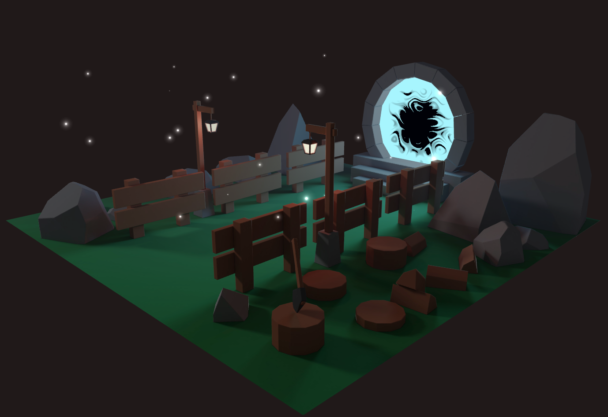

# [Portal-scene](https://portal-scene.kyledlong.com)

This particles project was built in the progress of the [Three.js journey](https://threejs-journey.com) course, focusing on blender models, baking, vertex/fragment shader particle effects.
<br>




## Tech

|                |               |
| -------------- | ------------- |
| JS             | Three.js      |
| HTML           | CSS           |
| Vite           | Github actions|
| Hostinger      | Webhooks      |


<br>

This project is a basic static website created using HTML, CSS, and JavaScript. For package management and development server, we use npm as the Node Package Manager along with Vite. Our Continuous Integration (CI) process involves automatically building artifacts from the main branch into the build branch whenever changes are pushed. This is achieved through GitHub Actions. Additionally, we have configured a webhook to send a POST request to a specified URL (in our case, Hostinger). As a result, any updates pushed to the main branch will trigger a build and update the production site accordingly.

<br>

## How to Use
<br>

1. Clone the repository:

```bash
git clone https://github.com/KD-Long/portal-scene.git
```

2. Install the dependencies:

```bash
cd portal-scene
npm install
```

3. Run the project:

```bash
npm run dev
```

3. Open your web browser and navigate to http://localhost:3000 to access the project.

4. For steps on how to intergrate CI into this project and have updates build to hostinger follow this [guide](https://dev.to/mwoodson11/create-deployment-pipeline-for-react-app-on-hostinger-5bc9).

<br>

## Workflow 

<br>

1. Git push from local --> main branch
```bash
git add --all
git commit -m 'commmit msg'
git push -u origin main
```

2. Github actions trigger build --> build branch (dist folder from $npm run build)

3. Webhook event triggered --> hostinger

4. Automatic deployment --> ~/public_html/_sub_portal-scene/

5. Configured sub domain [portal-scene.kyledlong.com](https://portal-scene.kyledlong.com) to point to "_sub_portal-scene/" folder